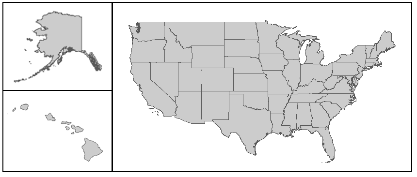
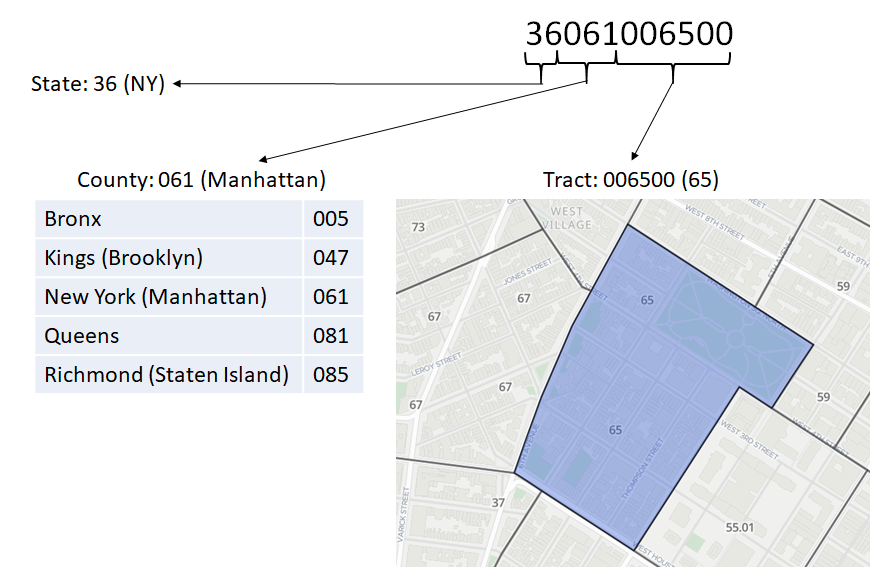
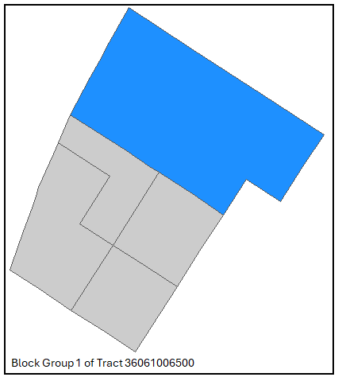

# Understanding Census Geographies

```{r include = FALSE}
knitr::opts_chunk$set(message = FALSE, warning = FALSE, out.width = "100%")
options(scipen = 999)

library(tidyverse)
library(srvyr)
library(DT)
```

Census data (aside from microdata sources like IPUMS) is never released at the individual level and is always aggregated to a geographic unit as counts, sums, medians, or binned distributions. As a result, selecting a survey product and variables also requires choosing the geographic level at which those variables will be aggregated. Smaller geographic units generally have higher margins of error, and some variables are unavailable at the smallest scales. Analyses that rely on these small units often use ACS 5-year estimates to pool five years of responses and improve accuracy. Beyond data availability, the appropriate geographic level depends on the project’s unit of analysis and overall analytical design.    

While Census blocks and tracts form the building blocks of all geographic levels at which Census data is reported, not all geographic levels perfectly “nest.” Nested geographies refers to the hierarchical “spine” from Census block to nation, where each unit at a lower level is fully contained within a single unit at the next level up, and each higher-level unit is completely partitioned into lower-level units. Non-nesting geographies still rely on Census blocks and tracts, but their boundaries sometimes cross those of higher levels (e.g., metropolitan statistical areas cross state lines, places like New York City cross county lines). Although Census blocks, tracts, and certain geographies such as congressional districts are collaboratively delineated so that Census data can be accurately aggregated to those geographies, many other geographies are defined independently (e.g., ZIP Codes). Because these independently defined units cannot be directly aggregated from Census blocks and tracks, the Census Bureau produces “tabulation areas” (e.g., ZCTAs) that approximate non-Census geographies using Census blocks and tracts. As a specific tabulation area becomes more widely used, the Census Bureau sometimes works with the managers of the approximated geography to better reflect the geography with Census blocks and tracts (e.g., the Census Bureau working with NYC DCP to redraw block and tract boundaries to better reflect Community Districts). 


<hr style="border:2px solid blue">

## Background 

The U.S. is composed of **states** and territories whose borders were fixed at the time of their admission to the union. With few exceptions, every state and territory is fully subdivided into **counties** or county-equivalent jurisdictions (e.g., parishes in Louisiana, boroughs in Alaska, municipios in Puerto Rico). States and territories all contain various forms of local government (e.g., **cities, towns, and villages**), though some states have counties entirely partitioned into local governments (e.g., towns in New York) while others maintain extensive unincorporated areas with no municipal government below the county level (e.g., unincorporated Los Angeles County). Historically, the Census has always reported data for these higher-level geographies.

Aside from larger cities with legally defined wards, Census data was not reported for smaller geographies until the end of the nineteenth century. For the 1890 Census, the federal government worked with several cities to establish “sanitary districts,” a new sub-ward level designed to provide more granular data for geographies with no independent legal status. These became the first small-area geographies ever reported by the Census, but the approach was abandoned in 1900. Meanwhile, settlement house researchers and other Progressive Era reformers were producing their own “statistical neighborhoods” and pressing the Census Bureau to adopt a consistent neighborhood-level reporting system.

In the early 1900s, Dr. Walter Laidlaw attempted to use New York State Assembly Districts to study neighborhood conditions in NYC. When the state redrew its district boundaries in 1905, he concluded that assembly districts were too unstable for long-term demographic analysis. Thus, in 1906 he published a paper proposing a system of permanent small areas with boundaries that would remain consistent between Censuses. He then persuaded the newly created Census Bureau to pilot the idea in the 1910 Census, producing tract tabulations for NYC as well as Baltimore, Boston, Chicago, Cleveland, Philadelphia, Pittsburgh, and St. Louis. The group expanded for the 1930 Census to include Los Angeles, Columbus, Nashville, Berkeley, Syracuse, and Yonkers. In 1931, the American Statistical Association formed a Committee on Census Enumeration Areas and appointed Howard Whipple Green as chair; Mr. Green spent the next twenty-five years encouraging cities nationwide to adopt and use the new tracts.

Institutionally, the Census Bureau standardized the tract delineation process in 1934. For the 1940 Census, it also began reporting block-level data for all cities with at least 50,000 residents. In cities where Census tracts already existed, blocks were nested within them; in cities without tracts, the Bureau created “block areas” (renamed “block numbering areas” (BNAs) in 1960) to function as equivalent geographies to tracts. During the 1970s and 1980s, BNAs expanded across much of the country, with the 1990 Census being the first to assign every part of the US to both a Census block and a tract/BNA. The 2000 Census then retired the BNA system entirely and converted all BNAs into Census tracts.

<hr style="border:2px solid blue">

## Nested Geographies

Taking full advantage of the nesting of these geographies, the Census Bureau labels units in each level with GEOIDs that build upon the GEOIDs of higher levels of geography so the full code string contains information: 

|Level |GEOID Structure |Digits |Example Area |Example GEOID |
|:-----|:-----|-----:|:-----|:-----|
|State |STATE |2 |New York |`36` |
|County |STATE+COUNTY |2+3=5 |New York, NY (Manhattan) |`36081` |
|Census Tract |STATE+COUNTY+TRACT |2+3+6=11 |Census Tract 65 in New York, NY |`36081006500` |
|Census Block Group |STATE+COUNTY+TRACT+FIRST DIGIT OF BLOCK |2+3+6+1=12 |Block Group 1 in Census Tract 65 in New York, NY |`360810065001`|
|Census Block |STATE+COUNTY+TRACT+BLOCK |2+3+6+4=15 |Block 1006 in Census Tract 65 in New York, NY |`360810065001006` |

### Nation

* `tidycensus` term = `us`



> Nation is the broadest geographic unit used for the presentation of Census data, representing the United States as a single summary entity. It encompasses the fifty states and the District of Columbia, though U.S. Territories, including Puerto Rico, are not part of the Nation for most Census data products.

### Regions

* `tidycensus` term = `region`


> Census Regions are groupings of states and the District of Columbia that subdivide the United States for the presentation of census data. There are four census regions: Northeast, Midwest, South, and West. Each of the four census regions is divided into two or more census divisions. Each census region is identified by a single-digit census code. The U.S. Territories, including Puerto Rico, are not part of any census region or census division. 

### Divisions 

* `tidycensus` term = `division`


> Census Divisions are groupings of states and the District of Columbia that are subdivisions of the four census regions. There are nine census divisions, and each is identified by a single-digit census code. The U.S. Territories, including Puerto Rico, are not part of any census region or census division. 

### States

* `tidycensus` term = `state`
* NY = `36`
* All States + DC = `c(1:2, 4:6, 8:13, 15:42, 44:51, 53:56)`


> States and Equivalent Entities are the primary governmental divisions of the United States. In addition to the 50 states, the Census Bureau treats the District of Columbia, Puerto Rico, American Samoa, the Commonwealth of the Northern Mariana Islands, Guam, and the U.S. Virgin Islands as the statistical equivalents of states for the purpose of data presentation.

```{r echo = FALSE}
read_csv("Data/state_codes.csv") %>% 
  dplyr::transmute(
    State,
    FIPS = stringr::str_pad(FIPS, 2, "left", "0"),
    Region,
    Division = str_remove_all(Division, "\xa0")
  ) %>% 
  DT::datatable()
```

### Counties

* `tidycensus` term = `county`
* NYC = `c("005", "047", "061", "081", "085")`


> The primary legal divisions of most states are termed counties. In Louisiana, these divisions are known as parishes. In Alaska, which has no counties, the equivalent entities are the organized boroughs, city and boroughs, municipalities, and census areas; the latter of which are delineated cooperatively for statistical purposes by the State of Alaska and the Census Bureau. Additionally, the Census Bureau treats the following entities as equivalents of counties for purposes of data presentation: municipios in Puerto Rico, districts and islands in American Samoa, municipalities in the Commonwealth of the Northern Mariana Islands, and islands in the U.S. Virgin Islands. In four states (Maryland, Missouri, Nevada, and Virginia), there are one or more incorporated places that are independent of any county organization and, thus, constitute primary divisions of their states. These incorporated places are known as independent cities and are treated as equivalent entities for purposes of data presentation. The District of Columbia and Guam have no primary divisions, and each area is considered an equivalent entity for purposes of data presentation in decennial censuses. All of the counties in Connecticut and Rhode Island and nine counties in Massachusetts were dissolved as functioning governmental entities; however, the Census Bureau continues to present data for these historical entities in order to provide comparable geographic units at the county level of the geographic hierarchy for these states and represents them as nonfunctioning legal entities in data products. Each county or statistically equivalent entity is assigned a three-character numeric Federal Information Processing Series (FIPS) code based on alphabetical sequence that is unique within state, and an eight-digit National Standard (NS) code.

```{r echo = FALSE}
readr::read_csv("Data/county_codes.csv") %>% 
  DT::datatable()
```

### Tracts

* `tidycensus` term = `tract` (must include a state or list of states)




> Census Tracts are small, relatively permanent statistical subdivisions of a county or statistically equivalent entity that can be updated by local participants prior to each decennial census as part of the Census Bureau’s Participant Statistical Areas Program (PSAP). The Census Bureau delineates census tracts in situations where no local participant responded or where state, local, or tribal governments declined to participate. The primary purpose of census tracts is to provide a stable set of geographic units for the presentation of statistical data.
>
> Census tracts generally have a population size between 1,200 and 8,000 people, with an optimum size of 4,000 people. A census tract usually covers a contiguous area; however, the spatial size of census tracts varies widely depending on the density of settlement. Census tract boundaries are delineated with the intention of being maintained over a long time so that statistical comparisons can be made from census to census. Census tracts occasionally are split due to population growth or merged as a result of substantial population decline.
> 
> Census tract boundaries generally follow visible and identifiable features. They may follow nonvisible legal boundaries, such as minor civil division (MCD) or incorporated place boundaries in some states and situations, to allow for census tract-to-governmental unit relationships where the governmental boundaries tend to remain unchanged between censuses. State and county boundaries always are census tract boundaries in the standard census geographic hierarchy. Tribal census tracts are a unique geographic entity defined within federally recognized American Indian reservations and off-reservation trust lands and can cross state and county boundaries. The tribal census tracts may be completely different from the standard county-based census tracts defined for the same area.

### Block Groups

* `tidycensus` term = `block group` (must include a state or list of states)




> Block Groups (BGs) are statistical divisions of census tracts, are generally defined to contain between 600 and 3,000 people, and are used to present data and control block numbering. A block group consists of clusters of blocks within the same census tract that have the same first digit of their four-digit census block number. For example, blocks 3001, 3002, 3003, . . . , 3999 in census tract 1210.02 belong to BG 3 in that census tract. Most BGs were delineated by local participants in the Census Bureau’s Participant Statistical Areas Program (PSAP). The Census Bureau delineated BGs only where a local or tribal government declined to participate in PSAP, and a regional organization or the State Data Center was not available to participate. A BG usually covers a contiguous area. Each census tract contains at least one BG, and BGs are uniquely numbered within the census tract. Within the standard census geographic hierarchy, BGs never cross state, county, or census tract boundaries, but may cross the boundaries of any other geographic entity. Tribal census tracts and tribal BGs are separate and unique geographic areas defined within federally recognized American Indian reservations and can cross state and county boundaries. The tribal census tracts and tribal block groups may be completely different from the standard county-based census tracts and block groups defined for the same area.

### Blocks

* `tidycensus` term = `block` (must include a state or list of states)


> Blocks (Census Blocks or Tabulation Blocks) are statistical areas bounded by visible features, such as streets, roads, streams, and railroad tracks, and by nonvisible boundaries, such as selected property lines and city, township, school district, and county limits and short line-of-sight extensions of streets and roads. Generally, blocks are small in area; for example, a city block bounded on all sides by streets. Blocks in suburban and rural areas may be larger, more irregular in shape, and bounded by a variety of features, such as roads, streams, and transmission lines. In remote areas, blocks may even encompass hundreds of square miles. Blocks cover the entire territory of the United States, Puerto Rico, and the Island Areas. Blocks nest within all other tabulated census geographic entities at the time of the decennial census and are the basis for all tabulated data from that census. Blocks are numbered uniquely with a four-digit census block number from 0000 to 9999 within census tract, which nest within state and county. The first digit of the census block number identifies the block group. Block numbers beginning with a zero (in Block Group 0) are intended to include only water area, but not all water-only blocks have block numbers beginning with 0 (zero).

<hr style="border:2px solid blue">

## Non-Nesting Geographies

### Place 

* `tidycensus` term = `place` (must include a state or list of states)
* NYC = `3651000`

> Incorporated Places are those reported to the Census Bureau as legally in existence as of January 1, as reported in the latest Boundary and Annexation Survey (BAS), under the laws of their respective states. An incorporated place is established to provide governmental functions for a concentration of people as opposed to a minor civil division (MCD), which generally is created to provide services or administer an area without regard, necessarily, to population. Places always are within a single state or equivalent entity, but may extend across county and county subdivision boundaries. An incorporated place usually is a city, town, village, or borough, but can have other legal descriptions. For Census Bureau data tabulation and presentation purposes, incorporated places exclude: Boroughs in Alaska (treated as statistical equivalents of counties); Towns in the New England states, New York, and Wisconsin (treated as MCDs); Boroughs in New York (treated as MCDs).
>
> Census Designated Places (CDPs) are the statistical counterparts of incorporated places, and are delineated to provide data for settled concentrations of population that are identifiable by name, but are not legally incorporated under the laws of the state in which they are located. The boundaries usually are defined in cooperation with local or tribal officials and generally updated prior to each decennial census. These boundaries, which usually coincide with visible features or the boundary of an adjacent incorporated place or another legal entity boundary, have no legal status, nor do these places have officials elected to serve traditional municipal functions. CDP boundaries may change from one decennial census to the next with changes in the settlement pattern; a CDP with the same name as in an earlier census does not necessarily have the same boundary. CDPs must be contained within a single state and may not extend into an incorporated place. There are no population size requirements for CDPs, but they must include some residential population or housing.
> 
> Hawaii, Puerto Rico, and Guam are the only states or state-equivalent entities that have no incorporated places recognized by the Census Bureau. All places shown in decennial census data products for Hawaii, Puerto Rico, and Guam are CDPs. By agreement with the State of Hawaii, the Census Bureau does not show data separately for the city of Honolulu, which is coextensive with Honolulu County. In Puerto Rico, CDPs are described as comunidades or zonas urbanas. Hamlets, primarily in the State of New York, are usually represented as CDPs in Census Bureau products.
> 
> Place Codes are of two types. The five-digit Federal Information Processing Series (FIPS) place code is assigned based on alphabetical sequence within a state. If place names are duplicated within a state and they represent distinctly different areas, a separate code is assigned to each place name alphabetically by the primary county in which each place is located, or if both places are in the same county, they are assigned alphabetically by their legal descriptions (for example, “city” before “village”). Places also are assigned an eight-digit National Standard (NS) code.

```{r echo = FALSE}
readr::read_csv("Data/place_codes.csv") %>% 
  DT::datatable() %>% 
  DT::formatRound("Population", digits = 0)
```

### Core Based Statistical Area (CBSA)

* `tidycensus` term = `cbsa`
* New York-Newark-Jersey City, NY-NJ-PA Metro Area = `35620`


> Core Based Statistical Areas (CBSAs) consist of the county or counties or equivalent entities associated with at least one core (Census Bureau-defined Urban Area) of at least 10,000 population, plus adjacent counties having a high degree of social and economic integration with the core as measured through commuting ties with the counties associated with the core. The general concept of a CBSA is that of a core area containing a substantial population nucleus, together with adjacent communities having a high degree of economic and social integration with that core. The term “core based statistical area” refers collectively to metropolitan statistical areas and micropolitan statistical areas. The U.S. Office of Management and Budget (OMB) defines CBSAs to provide a nationally consistent, standard set of geographic entities for the United States and Puerto Rico for use in tabulating and presenting statistical data. Statistical areas related to CBSAs include metropolitan divisions, combined statistical areas (CSAs), New England city and town areas (NECTAs), NECTA divisions, and combined NECTAs.

```{r echo = FALSE}
readr::read_csv("Data/metro_codes.csv") %>% 
  DT::datatable() %>% 
  DT::formatRound("Population", digits = 0)
```

### Public Use Microdata Area (PUMA)

* `tidycensus` term = `puma`


> Public Use Microdata Areas (PUMAs) are statistical geographic areas for the dissemination of decennial census and American Community Survey (ACS) Public Use Microdata Sample files in which the Census Bureau provides selected extracts of raw data from a small sample of census records that are screened to protect confidentiality. The ACS also uses the PUMAs as a tabulation geographic entity.

In NYC, PUMAs are an approximation of Community Districts (although the Census Bureau worked with the NYC DCP to create new Community District Tabulation Areas).

### ZIP Code Tabulation Area (ZCTA)

* `tidycensus` term = `zcta`


> ZIP Code Tabulation Areas (ZCTAs) are approximate area representations of U.S. Postal Service (USPS) five-digit Zonal Improvement Plan (ZIP) Code service routes that the Census Bureau creates using whole blocks to present statistical data from censuses and surveys. The Census Bureau defines ZCTAs by allocating each block that contains addresses to a single ZCTA, usually to the ZCTA that reflects the most frequently occurring ZIP Code for the addresses within that tabulation block. Blocks that do not contain addresses, but are surrounded by a single ZCTA (enclaves) are assigned to the surrounding ZCTA; those surrounded by multiple ZCTAs are added to a single ZCTA based on limited buffering performed between multiple ZCTAs. The Census Bureau identifies five-digit ZCTAs using a five-character numeric code that represents the most frequently occurring USPS ZIP Code within that ZCTA, and this code has a fixed length of five digits and may contain leading zeros. Not all ZIP Codes in use by the USPS may have a ZCTA delineated to represent them, The USPS makes periodic changes to ZIP Codes to support more efficient mail delivery. In addition, the ZCTA delineation process primarily uses residential addresses and has a bias towards ZIP Codes used for city-style mail delivery, thus there may be ZIP Codes that are primarily nonresidential or used for PO boxes only that may not have a corresponding ZCTA. ZIP Code is a trademark of the U.S. Postal Service.

### Legislative Distrcts 

* `tidycensus` term = `congressional district`
* `tidycensus` term = `state legislative district (upper chamber)` (senate)
* `tidycensus` term = `state legislative district (lower chamber)` (house)

> Congressional Districts are the 435 areas from which people are elected to the U.S. House of Representatives. After the apportionment of congressional seats among the states based on decennial census population counts, each state with multiple seats is responsible for establishing congressional districts for the purpose of electing representatives. Each congressional district is to be as equal in population to all other congressional districts in a state as practicable. For the District of Columbia, Puerto Rico, and each Island Area, a separate code is used to identify the entire areas of these state-equivalent entities as having a single nonvoting delegate.
> 
> State Legislative Districts (SLDs) are the areas from which members are elected to state legislatures. The Census Bureau first reported data for SLDs as part of the 2000 Public Law 94-171 Redistricting Data File.

<hr style="border:2px solid blue">

**Sources**

* [Census Bureau History of Census Tracts and Blocks](https://www.census.gov/about/history/historical-censuses-and-surveys/census-programs-surveys/geography/tracts-and-block-numbering-areas.html)
* [Census Bureau Geographic Glossary](https://www.census.gov/programs-surveys/geography/about/glossary.html)
* [Census Bureau Hierarchies](https://www2.census.gov/geo/pdfs/reference/geodiagram.pdf)
* [Census Bureau GEOIDS](https://www.census.gov/programs-surveys/geography/guidance/geo-identifiers.html)